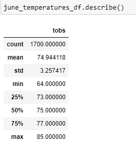
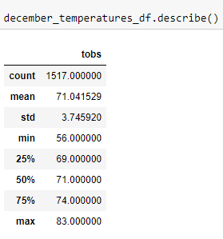

# surfs_up

## Table of contents
* [Project title](#project-title)
* [Technologies](#technologies)
* [Overview](#overview)
* [Analysis](#analysis)


 
## Project title
Surfs_up

## Technologies
[Python](https://www.python.org/downloads/ "Download Python") 3.7.9.

## Overview
Looking to start a Surf n'Shake shop serving surfboards and ice cream to locals and tourists in Oahu, Hawaii. To get this off the ground, one needs some investor backing and an investor, who is interested in investing, is questioning the weather in Hawaii and asking for analytics on a weather dataset from Oahu. Specifically, the investor wants temperature data for the months of June and December in Oahu, in order to determine if the surf and ice cream shop business is sustainable year-round.


## Analysis




* There is a relatively small difference(less than 4°F) between the average temperature in Oahu in June and December.
* Temperature in Oahu in June and December does not reach over 85°F. 
* It is possible that the temperature in Oahu could go down to 56°F in December.

Tourism in Hawaii is very important and its businesses really depends on it -- according to state government data, there were over 9.4 million visitors to the Hawaiian Islands with expenditures of over $16 billion in 2017 alone. It is imperative to figure out what would make those tourists spend their money and time in your store and its weather is one of the factors that would attract more or less customers.
According to the anaylsis above, the weather does not change significantly from June to Decemeber. These two additional queries are helpful to see how much rain they get in June and in Decemember:

```python
June_prcp = session.query(Measurement.date, Measurement.prcp).filter(extract('month', Measurement.date) == 6).all()
list(June_prcp)
```
```python
Dec_prcp = session.query(Measurement.date, Measurement.prcp).filter(extract('month', Measurement.date) == 12).all()
list(Dec_prcp)
```
It is clear that Oahu, Hawaii in December is colder and rains more than in June and, therefore, one could expect a little slow month, or people may not spend their time outside and decide to spend more time in store getting ice cream or shopping. However, the data is showing that the differences (whether the temperature or the amount of rain) between June and December are not huge, which makes this business proposal more appealing. 

